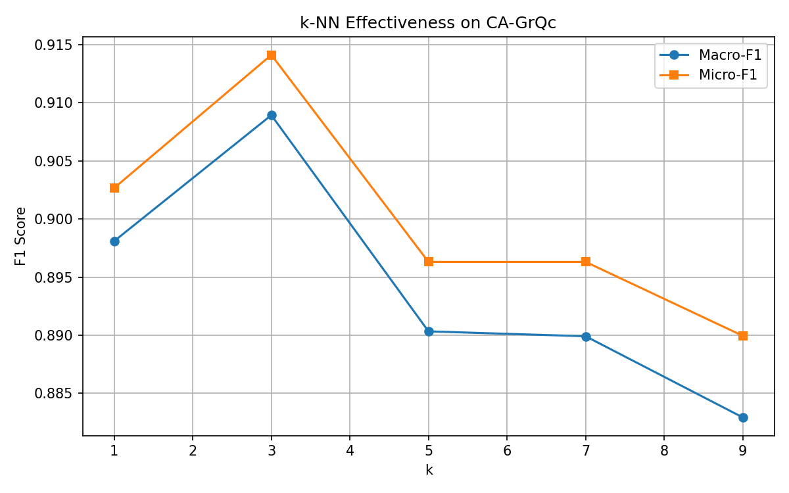
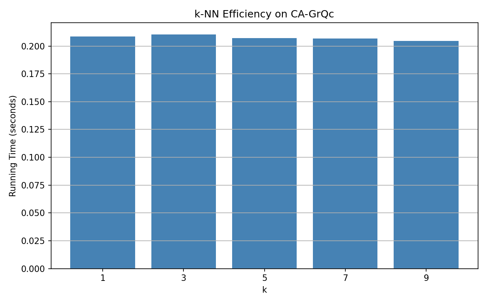
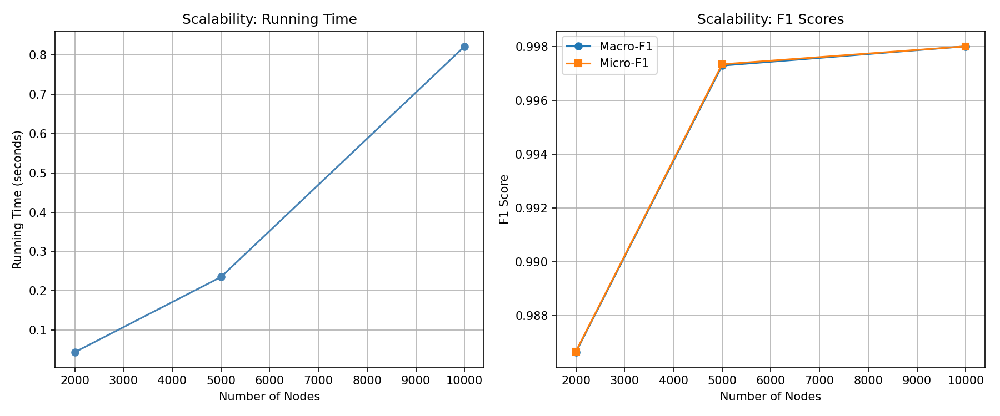

<div align="center">

# 📊 k-NN Graph Classifier

**Machine learning classification on real-world collaboration networks using k-Nearest Neighbors**

[](https://python.org)
[](https://networkx.org)
[](https://numpy.org)
[](LICENSE)

</div>

---

## 📋 Overview

A complete **k-Nearest Neighbors classification pipeline** that operates on real-world graph data. The project extracts structural features from collaboration networks and uses them to classify nodes — all implemented **from scratch** without scikit-learn.

### Datasets
| Dataset | Nodes | Edges | Source |
|---------|-------|-------|--------|
| CA-GrQc | 5,242 | 28,980 | Arxiv General Relativity collaborations |
| com-DBLP | 317,080 | 1,049,866 | DBLP computer science collaborations |

---

## ✨ Features

- 🧠 **k-NN from scratch** — No scikit-learn; core algorithm hand-implemented
- 📐 **Graph feature extraction** — Degree, clustering coefficient, average neighbor degree
- 📊 **Multi-k evaluation** — Tests k = 1, 3, 5, 7, 9
- 📈 **Evaluation metrics** — Macro-F1 and Micro-F1 scores
- ⏱️ **Efficiency benchmarks** — Running time analysis per k value
- 📉 **Scalability testing** — Performance on both small and large datasets
- 📊 **Auto-generated plots** — Effectiveness, efficiency, and scalability charts

---

## 📈 Results

### Effectiveness (F1 Scores)


### Efficiency (Running Time)


### Scalability


---

## 🚀 Quick Start

### Prerequisites
```bash
pip install numpy networkx matplotlib
```

### Run
```bash
# Clone the repository
git clone https://github.com/tonytheg/knn-graph-classifier.git
cd knn-graph-classifier

# Run the full pipeline
python knn_classifier.py
```

The script will:
1. Load the graph dataset
2. Extract node features (clustering coefficient, avg neighbor degree)
3. Generate labels based on degree threshold
4. Run k-NN classification for k = 1, 3, 5, 7, 9
5. Output F1 scores and timing results
6. Save plots to `results/`

---

## 🏗️ How It Works

### Feature Extraction Pipeline
```
Raw Graph (edge list)
    │
    ├── Compute node degree
    ├── Compute clustering coefficient
    └── Compute average neighbor degree
    │
    ▼
Feature Matrix [n_nodes × 2]
    │
    ├── Label: degree > median → 1 (high), else → 0 (low)
    └── Split: 70% train / 30% test
    │
    ▼
k-NN Classification (Euclidean distance)
    │
    ▼
Evaluation (Macro-F1, Micro-F1, Runtime)
```

### k-NN Algorithm (from scratch)
1. For each test point, compute Euclidean distance to all training points
2. Select the k nearest neighbors
3. Majority vote determines the predicted label
4. Compute precision, recall, and F1 per class

---

## 📁 Project Structure

```
knn-graph-classifier/
├── knn_classifier.py    # Main pipeline: feature extraction, k-NN, evaluation
├── data/
│   └── CA-GrQc.txt      # Small dataset (Arxiv collaborations)
├── results/
│   ├── effectiveness.png # F1 score chart
│   ├── efficiency.png    # Runtime chart
│   └── scalability.png   # Scalability chart
├── README.md
└── LICENSE
```

---

## 📄 License

This project is licensed under the MIT License — see the [LICENSE](LICENSE) file for details.

---

<div align="center">

**Built with Python, NetworkX & NumPy**

</div>
